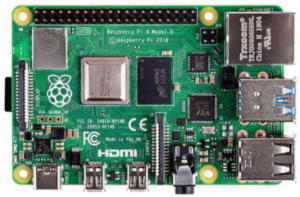
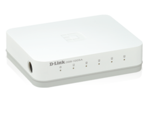
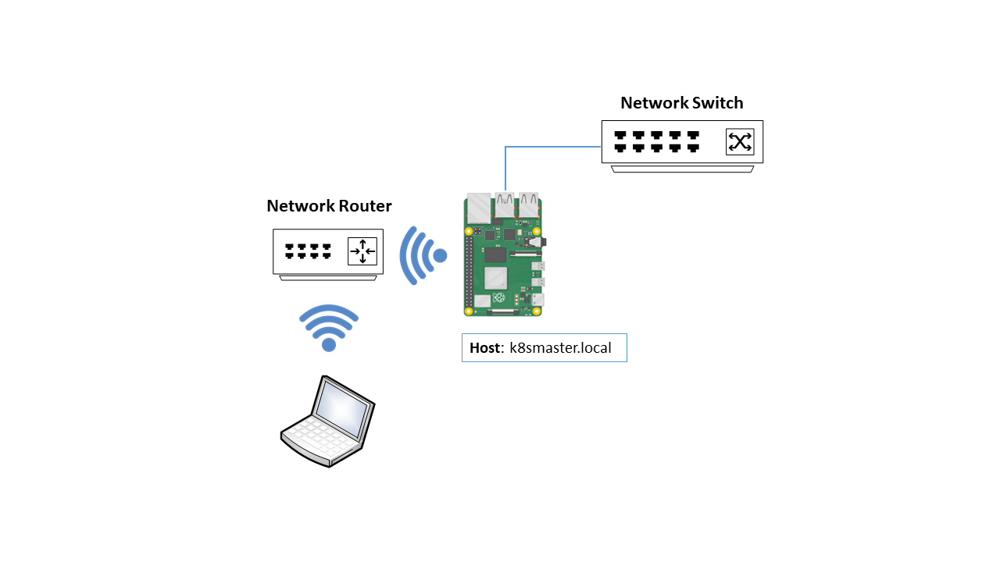

# Azure Functions on a Raspberry Pi Kubernetes Cluster

|Author|Dave Glover, Microsoft Australia|
|----|---|
|Platform| Raspberry Pi, Raspbian Buster, Kernel 4.19|
|Date|October 2019|


## Parts List

|Items||
|-----|----|
| 1 x Raspberry Pi for Kubernetes Master. I used Raspberry 3B Plus.<br/><br/>2 x Raspberry Pis for Kubernetes Nodes: I used Raspberry Pi 4 4GBs.<br/><br/>3 x SD Cards (min 16GB, smaller if using USB3 SSD drives for nodes.<br/><br/>3 Power supplies, one for each Raspberry Pi.| |
|1 x Network Switch [Dlink DGS-1005A](https://www.dlink.com.au/home-solutions/DGS-1005A-5-port-gigabit-desktop-switch) or similar|  |
|1 x [Raspberry Pi Rack](https://www.amazon.com.au/gp/product/B013SSA3HA/ref=ppx_yo_dt_b_asin_title_o02_s00?ie=UTF8&psc=1) or similar |  |
|Optional: 2 x [Pimoroni Blinkt](https://shop.pimoroni.com/products/blinkt) RGB Led Strips | . The BlinkT LED Strip can be a great visual representation of pod state. |
|Optional: 3 x 25 CM Ethernet Patch Cables | |
|Optional: 2 x USB3 SSDs for Kubernetes Nodes (Enabled for boot from USB) |  |

## Creating Raspberry Pi Boot SD Cards

1. Using [balena Etcher](https://www.balena.io/etcher/), flash 3 x SD Cards with [Raspbian Buster Lite](https://www.raspberrypi.org/downloads/raspbian/)
2. On **ONE** SD Card, add the a **wpa_supplicant.conf** file with your WiFi Routers WiFi settings. This card with be used for the Kuberetes Master.

    ```text
    ctrl_interface=DIR=/var/run/wpa_supplicant GROUP=netdev
    update_config=1
    country=AU

    network={
        ssid="SSID"
        psk="WiFi Password"
    }
    ```

3. On **ALL** SD Cards add an empty file named **ssh**. This enabled SSH for the Raspberry Pi when it boots up.

## Kubernetes Master Installation



SSH to what will you will become the Kubernetes Master and run the following command:

```bash
bash -c "$(curl https://raw.githubusercontent.com/gloveboxes/Raspberry-Pi-Kubernetes-Cluster/master/setup.sh)"
```

The installation **setup.sh** bash script will first install **git** on the Raspberry Pi, this git repository will then cloned to the device, and then you will be prompted to install the Kubernetes Master or Node. Select **Master**

The installation will performance the following operations:

1. The Raspberry Pi will be renamed to **k8smaster**
2. Various optimizations/prerequisites set (tmpfs, GPU memory, 64bit kernel enabled, swap diabled, cgroups for k8s, iptables set to legacy mode)
3. Network settings configured (Static address for eth0, and packet routing defined)
4. DHCP Server and Docker installed
5. The Raspberry pi will reboot after Docker installation
6. Reconnect as **ssh pi@k8smaster.local**
7. The installation will restart
8. Kubernetes will be installed
9. [Flannel CNI](https://kubernetes.io/docs/concepts/cluster-administration/networking/#the-kubernetes-network-model) (Cluster Networking) installed
10. [MetalLB LoadBalance](https://metallb.universe.tf/) installed
11. Kubernetes Dashboard installation and configuration for admin access

## Kubernetes Node Set Up


Ensure the k8smaster and the Raspberry Pi that will be the first Kubernetes node are powered on and connected to the Network Switch. The DHCP Server running on the k8smaster will allocate an IP Address to the Raspberry Pi that will be the Kubernetes node.


1. Reconnect to the k8smaster **ssh pi@k8smaster.local**
2. From the k8smaster device **ssh pi@raspberry.local**
3. Run the following command from the SSH terminal:

    ```bash
    bash -c "$(curl https://raw.githubusercontent.com/gloveboxes/Raspberry-Pi-Kubernetes-Cluster/master/setup.sh)"
    ```

## Installing kubectl on your Desktop Computer

1. [Install and Set Up kubectl](https://kubernetes.io/docs/tasks/tools/install-kubectl/)
2. Open a terminal window on your desktop computer
3. Change directory to your home directory
    * macOS, Linux, and Windows Powershell `cd ~/`, Windows Command Prompt `cd %USERPROFILE%`
4. Copy Kube Config from **k8smaster.local**

    ```bash
    scp -r pi@k8smaster.local:~/.kube .kube
    ```

## Kubernetes Dashboard

Acknowledgements:

* [Creating admin user to access Kubernetes dashboard](https://medium.com/@kanrangsan/creating-admin-user-to-access-kubernetes-dashboard-723d6c9764e4)

1. From the Kubernetes Master (ssh pi@k8smater.local), create a Dashboard access token

    ```bash
    kubectl -n kube-system describe secret $(kubectl -n kube-system get secret | grep admin-user | awk '{print $1}')
    ```

On Desktop computer start the Kubernetes Proxy

```bash
kubectl proxy
```

From your web browser, link to:

**http://localhost:8001/api/v1/namespaces/kubernetes-dashboard/services/https:kubernetes-dashboard:/proxy/#/overview?namespace=default** 


## Raspberry Pi Cluster


